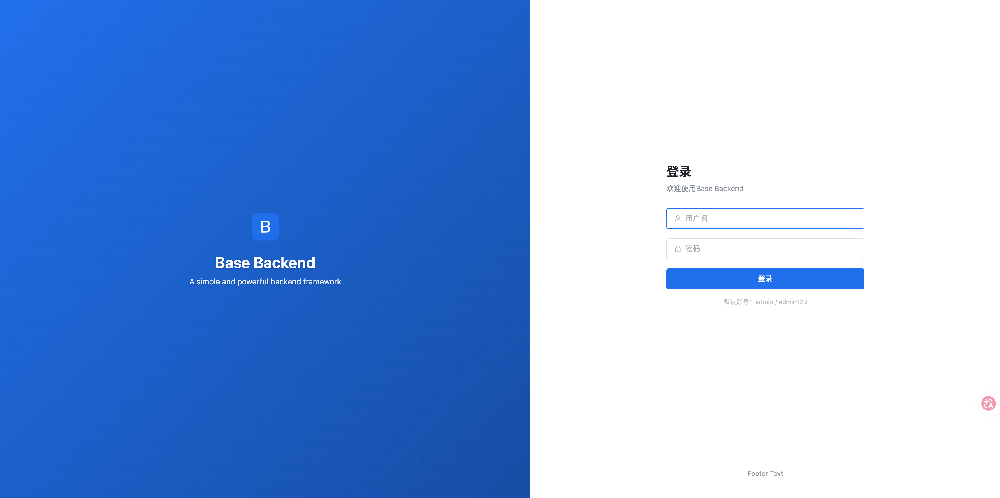
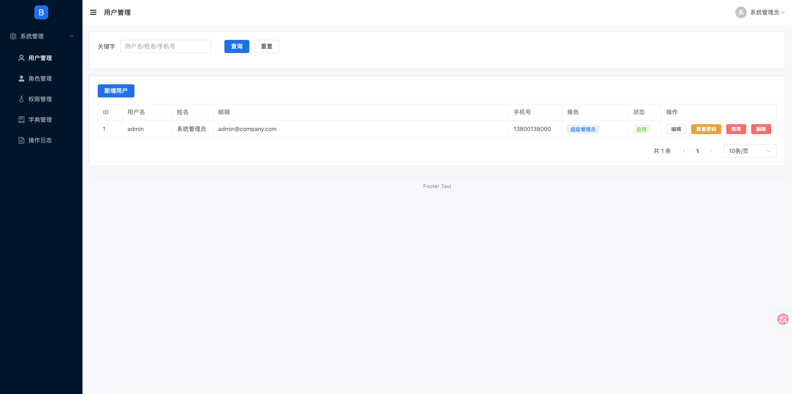
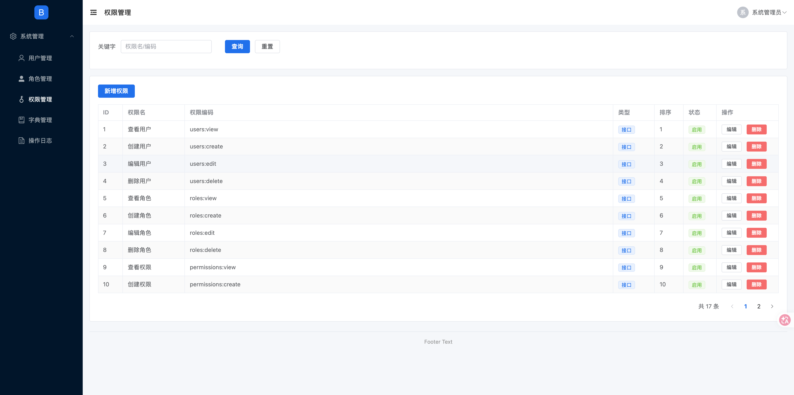
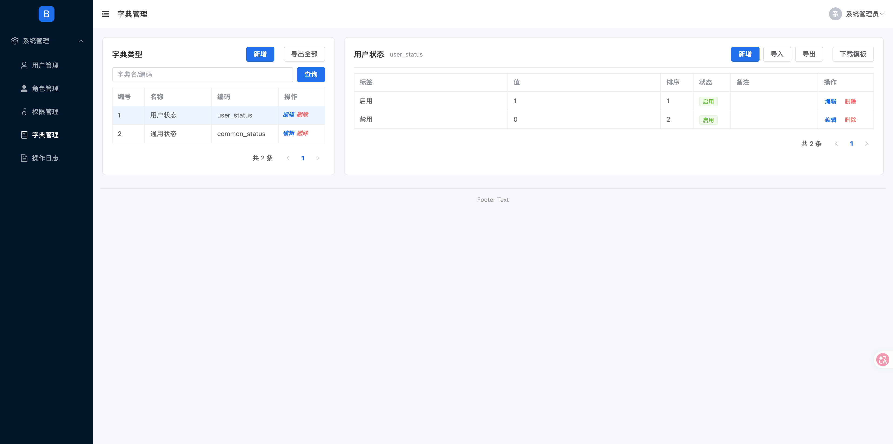

# Base 脚手架基座

> 企业管理系统**多端脚手架基座**：Go + Gin + GORM × Vue3 + Element Plus × Vue3 + Vant × uniapp

这是一个**可运行的多端 monorepo 骨架**，从企业固定资产管理系统中提炼出与业务无关的可复用横切能力与工程约定。clone 后执行 `make init name=my-system` 改名即可开始开发新项目。

内置「系统管理五件套」是开箱即用的能力实现，但**非代码范例**——新增业务模块的范例唯一指向 `backend/_example/`。

---

## 功能预览

| 登录页（品牌可配置） | 用户管理 |
|---|---|
|  |  |

| 权限管理（RBAC 权限码） | 字典管理（Excel 导入导出） |
|---|---|
|  |  |

---

## 定位

```
┌──────────────────────────────────────────────────────────────────────┐
│                    base/ 脚手架基座                                    │
├──────────────┬──────────────┬──────────────────┬───────────────────┤
│   backend/   │  frontend/   │     mobile/       │     miniapp/       │
│  Go + Gin    │  Vue3 +      │   Vue3 + Vant     │  uniapp + Vue3     │
│  GORM        │  Element Plus│   移动端 H5       │  微信小程序         │
│  三层分层    │  Pinia       │   Pinia           │  Pinia             │
└──────────────┴──────────────┴──────────────────┴───────────────────┘
              │                    │                    │
              └──────────┬─────────┴──────────┬────────┘
                         ▼
     统一响应协议 + 统一鉴权(JWT) + RBAC 权限 + 操作日志 + 品牌配置
```

四个端共享同一套**协议与工程铁律**，由护栏（guard + ESLint）强制：

- **统一响应**：`{code, message, data}`，分页 `{list, total, page, page_size}`。
- **统一鉴权**：JWT（`Authorization: Bearer <token>`），401/403 由前端拦截器统一处理。
- **RBAC 权限**：用户-角色-权限三级模型，受保护路由挂 `PermissionRequired("<资源>:<动作>")`。
- **操作日志**：`OperationLogger` 中间件自动记录受保护路由的操作与登录日志。
- **多端统一**：状态管理一律 `stores/`、路径别名 `@` → `src/`、字段 JSON tag 用 snake_case。
- **架构护栏**：后端 `internal/guard/` 与根 `eslint.config.js` 把铁律编译成「违反即测试/Lint 失败」的静态检查。

---

## 目录结构

```
base/
├── Makefile                 # 统一命令入口（test/lint/smoke/gen/init/dev/package）
├── deps.yaml                # 依赖登记表（新增依赖 MUST 在此登记，guard 双向校验）
├── AGENTS.md                # 跨端 AI 开发宪法（通用铁律）
├── eslint.config.js         # 跨端共享 ESLint 护栏（四端共用同一份）
├── eslint-rules/            # 自定义 ESLint 规则（menu-group.js 菜单归组检查）
├── contracts/               # openapi.yaml 接口契约（字段/响应形状唯一真相）
├── scripts/                 # init.sh 一键初始化 / package.sh 多平台打包
├── docs/                    # 规范文档 + images/（界面截图）
│   ├── map.md               # 代码导航地图（哪类代码在哪个文件，先读它）
│   ├── API协议.md / 鉴权与权限.md / 后端分层规范.md
│   ├── 代码规范.md / 目录结构约定.md / 配置体系.md / 依赖管理.md
│   └── images/              # README 界面截图
├── openspec/                # OpenSpec 变更记录（changes + specs）
│
├── backend/                 # Go 后端（controller → service → model 三层）
│   ├── main.go              # 入口：DB → Gin → 路由 → 启动
│   ├── config/              # 配置（默认值 → YAML → 环境变量）
│   ├── database/            # SQLite(WAL)/MySQL 双驱动 + AutoMigrate + 幂等基础数据
│   ├── models/              # 数据模型（内嵌 BaseModel）
│   ├── middleware/          # JWT / CORS / 操作日志 / RBAC 权限
│   ├── services/            # 业务逻辑层
│   ├── controllers/         # 控制器层（校验 + 调 service + 组装响应）
│   ├── router/              # 路由接线（router.go）+ 前端产物托管（serve.go）
│   ├── utils/               # 统一响应 / JWT / 微信登录 等
│   ├── static/              # 品牌静态资源（logo / favicon / 登录背景图）
│   ├── _example/            # 新模块「黄金路径」唯一范例（含前端 api.js/index.vue）
│   ├── internal/guard/      # 架构护栏测试（分层/RBAC/依赖登记等）
│   ├── scripts/             # gen-module.sh 生成器 / pluralize.sh 复数 / smoke.sh 冒烟
│   └── CLAUDE.md            # 后端域宪法
│
├── frontend/                # Web 前端（Vue3 + Element Plus + Pinia）
│   └── src/
│       ├── api/index.js     # API 定义
│       ├── layout/          # Layout.vue（两级分组菜单 + 权限过滤）
│       ├── router/          # 两级菜单路由（分组 + 叶子，经 menu-group 护栏强制）
│       ├── stores/          # Pinia 状态（统一 stores/）
│       ├── utils/           # request.js 请求封装（401/403 统一拦截）
│       ├── views/           # Login.vue / ErrorPage.vue + system/ 五件套
│       └── CLAUDE.md        # 前端域宪法
│
├── mobile/                  # 移动端 H5（Vue3 + Vant + Pinia，端口 5174）
│   └── src/
│       ├── api/  components/  router/  stores/  utils/
│       └── views/           # Login.vue / Home.vue / Mine.vue
│
└── miniapp/                 # 微信小程序端（uniapp + Vue3 + Pinia）
    └── src/
        ├── api/             # API 定义
        ├── pages/           # 页面（pages.json 注册，login/ + index/）
        ├── stores/          # Pinia 状态（统一 stores/）
        ├── utils/           # request 封装（uni.request，禁裸调）
        └── manifest.json / pages.json
```

> 目录是**规范约的容器**，具体每个目录放什么、照着谁写，见 [`docs/map.md`](docs/map.md) 与 [`AGENTS.md`](AGENTS.md)。

---

## 技术栈

| 层 | 技术 |
|---|---|
| 后端 | Go 1.21+ / Gin / GORM / SQLite（纯 Go，WAL）+ MySQL 双驱动 / JWT / bcrypt / yaml / excelize（Excel 导入导出） |
| 前端 | Vue3 / Vite / Element Plus / Pinia / Vue Router / axios / dayjs |
| 移动端 | Vue3 / Vite / Vant / Pinia / Vue Router / axios |
| 小程序端 | uniapp（@dcloudio CLI）/ Vue3 / Pinia / uni-mp-weixin，目标 mp-weixin |

依赖清单的唯一真相见 [`deps.yaml`](deps.yaml)，新依赖 MUST 登记并附理由。

---

## 快速启动

### 环境要求

| 工具 | 版本要求 |
|------|---------|
| Go | >= 1.21 |
| Node.js | >= 18.0 |
| npm | >= 9.0 |

### 第一步：启动后端

```bash
cd backend
go mod tidy
go run main.go        # 或根目录 make dev-backend
```

默认监听 `http://localhost:8080`，启动即自动迁移建表并幂等初始化基础数据，输出默认管理员账号 `admin / admin123`（角色：超级管理员）。非管理员演示账号可自行在用户管理中创建「普通用户」角色。

### 第二步：启动 Web 前端

```bash
cd frontend
npm install
npm run dev           # 或根目录 make dev-frontend
```

访问 http://localhost:5173 ，使用 `admin / admin123` 登录。dev 已代理 `/api`、`/static` 到后端 8080。

### 第三步（可选）：启动移动端 H5

```bash
cd mobile
npm install
npm run dev
```

访问 http://localhost:5174 。后端地址由 `mobile/.env` 的 `VITE_API_BASE` 决定（默认 `http://localhost:8080`）。

### 第四步（可选）：启动微信小程序端

```bash
cd miniapp
npm install
npm run dev:mp-weixin
```

构建产物在 `miniapp/dist/dev/mp-weixin/`，用微信开发者工具导入该目录预览。需在 `miniapp/src/manifest.json` 填入小程序 `mp-weixin.appid`，并在 `miniapp/.env` 配 `VITE_API_BASE`（真机联调须为后端 HTTPS 域名，且在小程序后台配置 request 合法域名）。小程序微信登录（`/api/auth/mp-login`）需在 `backend/config.yaml` 的 `wechat` 段填 `app_id`/`secret`，未配置不影响基座启动。

---

## 统一命令入口

根目录 `Makefile` 收编所有零散脚本，AI 与人都只记 `make <target>`：

```bash
make test              # 后端全部测试（含 internal/guard 架构护栏）
make lint              # go vet + 四端 ESLint（含 menu-group 菜单归组规则）
make smoke             # 冒烟：构建 → 启动 → 登录 → 命中受保护路由 → 断言 → 清理
make gen name=<模块> [group=<分组>]   # 从 _example/ 生成新业务模块完整骨架
make init name=<项目> [module=...] [db_name=...] [issuer=...] [app_name=...] [port=...]  # 一键初始化新项目
make package [TARGET=--linux | --windows]   # 多平台部署包（默认本地平台）
make dev               # 并行启动后端 + 前端（Ctrl-C 同时退出）
make dev-mp / build-mp # 小程序 dev / 构建 mp-weixin 产物
```

---

## 内置能力

系统管理五件套开箱即用（可作为参照实现运行，但新增模块请照 `_example/` 范例）：

- **用户管理**：CRUD、启用/禁用、密码重置、分配角色。
- **角色管理**：CRUD、按角色配置权限（授权后权限码幂等落库）。
- **权限管理**：CRUD、权限码 `{资源:动作}`（复数资源，如 `users:view`）；初始化按 `code` 幂等补齐，新模块权限自动纳入既有库。
- **字典管理**：字典类型 + 字典项维护，支持 **Excel 导入 / 导出 / 下载模板**（excelize）。
- **操作日志**：操作日志 + 登录日志查询，清空操作日志仅限超级管理员（`AdminRequired`）。

其他横切能力：

- **品牌可配置**：`config.yaml` 的 `app` 段（name/subtitle/logo/favicon/login_bg/login_bg_mobile/footer）驱动四端登录页、标题与页脚；静态资源放 `backend/static/`，经 `/api/system/info` 下发。
- **三层配置**：默认值 → YAML → 环境变量，逐层覆盖。
- **单进程部署**：`frontend build` 产物拷入 `backend/dist/`、移动端 H5 拷入 `backend/dist-mobile/`，后端自动托管并 SPA 回退（桌面 `/`、移动 `/m/`），无需独立静态服务器。

---

## 工程护栏（改了代码怎么证明没坏）

基座把架构约定「编译」成了会失败的检查，靠 CI 变红而不是靠 code review：

- **分层与协议护栏**（`backend/internal/guard/`，`make test` 强制）：三层职责不得互相越界、响应 MUST 走 `utils/response`、受保护路由的权限码 MUST 已注册进 `initBaseData`（否则非管理员将 403 且界面无法自救）、模型 MUST 内嵌 `BaseModel` 等。
- **依赖登记护栏**：`deps.yaml` 登记表与 `go.mod` / 各端 `package.json` 双向校验——漏登记或僵尸条目都让 `make test` 失败。
- **前端护栏**（根 `eslint.config.js`，`make lint` 强制）：禁止直接 `import axios`（必须走 `@/utils/request`）、状态管理目录禁止 `store/` 单数、`miniapp` 禁止裸调 `uni.request`、菜单 MUST 归入两级分组（`eslint-rules/menu-group.js`）。
- **冒烟**（`make smoke`）：真实起服务走一遍 登录 → 受保护路由 → 断言，防启动即崩。

---

## 如何基于基座新建项目

1. **复制目录**：把整个基座复制到新项目目录（不含 `.git`）。
2. **一键初始化**：

   ```bash
   make init name=my-system app_name="我的系统"
   # 或 ./scripts/init.sh my-system --app-name "我的系统"
   ```

   自动完成：改 Go 模块名（含 `_example/` 模板 import）、改三端包名、改环境变量前缀、重置 JWT 密钥、按 `--port` 生成 `frontend/.env` 与 `mobile/.env`、清空基座 OpenSpec 历史与运行时残留（`*.db` / `config.yaml`）。

   可选参数：`module=<go 模块名>`、`db_name=<数据库名>`、`issuer=<JWT 签发者>`、`app_name=<系统名称>`（替换中文品牌残留）、`port=<后端端口>`。

3. **验证**：

   ```bash
   make test && make smoke && make lint
   ```

4. **配置**：`cp backend/config.example.yaml backend/config.yaml`，按需设置端口、数据库类型、品牌与微信登录。

5. **开发新业务模块**：`make gen name=asset` 一键生成（见下节）。

## 如何新增业务模块

```bash
make gen name=asset                       # 自建分组（URL /assets）
make gen name=asset_categories group=asset # 注入已有分组（URL /asset/asset_categories）
```

从唯一范例 `backend/_example/` 生成全套骨架并自动接线：

- 后端：`models/<name>.go` + `services/<name>_service.go` + `controllers/<name>.go`
- 路由注入：`router.go`（`【gen:routes】`）、`database.go` AutoMigrate（`【gen:migrate】`）与权限码（`【gen:permissions】`）
- 前端：`views/<name>/index.vue` + `api/index.js` + `router/index.js` 分组菜单路由

生成的文件带 `// TODO: 业务逻辑` 锚点，填充即可；路由路径与权限码前缀统一用**资源复数**（规则单一真相 `backend/scripts/pluralize.sh`）。

> 详细约定与命名规范见 [`docs/map.md`](docs/map.md)、`AGENTS.md` 及 `backend/CLAUDE.md`、`frontend/CLAUDE.md`。

---

## 文档导航

| 想知道什么 | 读哪里 |
|---|---|
| 多端统一铁律、依赖登记、验证入口 | [`AGENTS.md`](AGENTS.md)（跨端宪法） |
| 后端分层 / RBAC 接线 / 数据库约定 | [`backend/CLAUDE.md`](backend/CLAUDE.md) |
| 前端请求封装 / 菜单结构 / 命名 | [`frontend/CLAUDE.md`](frontend/CLAUDE.md) |
| 代码导航地图、新模块命名约定 | [`docs/map.md`](docs/map.md) |
| 接口契约（字段/响应形状唯一真相） | [`contracts/openapi.yaml`](contracts/openapi.yaml) |
| 协议 / 鉴权 / 规范 / 配置 / 依赖 | `docs/API协议.md`、`docs/鉴权与权限.md`、`docs/代码规范.md`、`docs/后端分层规范.md`、`docs/目录结构约定.md`、`docs/配置体系.md`、`docs/依赖管理.md` |

---

## License

[MIT](./LICENSE) © Benny66
